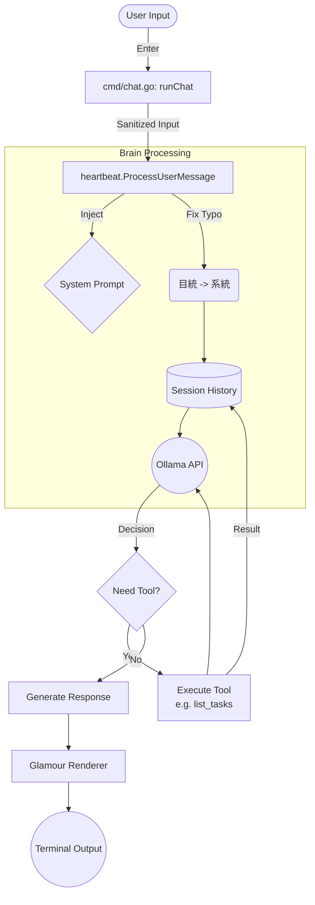

# PCAI 啟動與執行流程解析

本文件詳細梳理 PCAI (Personalized Contextual AI) 專案的啟動流程，以及核心模組在執行過程中的初始與運作機制。專案採用 [Cobra](https://github.com/spf13/cobra) 框架來管理命令列介面 (CLI)。

## 1. 程式進入點 (Entry Point)

所有執行皆從 `main.go` 開始：
```go
package main

import "github.com/asccclass/pcai/cmd"

func main() {
	cmd.Execute()
}
```
`cmd.Execute()` 會呼叫位於 `cmd/root.go` 的根指令 (`rootCmd.Execute()`)，根據使用者輸入的參數決定要執行哪個子指令。

主要支援的指令包括：
*   **`chat`**：開啟具備 AI Agent 能力的對話（核心功能）。
*   **`health`**：檢查 PCAI 運作環境與背景任務狀態。
*   **`auth`**：管理外部服務授權（如 Google OAuth）。
*   **`serve`**：啟動記憶管理 Web 伺服器。

---

## 2. 核心對話模式啟動流程 (`pcai chat`)

當執行 `pcai chat` 時，程式會進入 `cmd/chat.go` 的 `runChat` 函數。這是系統最主要且最複雜的啟動流程。

### 階段 2.1：基礎設定與環境初始化
1.  **載入設定 (`config.LoadConfig`)**：解析環境變數 (`envfile` 或系統變數) 與 CLI 標籤 (如 `-m` 模型名稱, `-s` 系統提示詞)。
2.  **UI 渲染器 (`Glamour`)**：初始化終端機 Markdown 渲染器，用於美化 AI 輸出的呈現。
3.  **背景任務管理 (`BackgroundManager`)**：建立 `tools.NewBackgroundManager()`，用於追蹤與通知在背景非同步執行的任務（如定時任務、系統操作），並設定至全域變數 `GlobalBgMgr`。
4.  **系統日誌 (`SystemLogger`)**：初始化 `agent.NewSystemLogger("botmemory")`，將系統層級的重要操作記錄下來。

### 階段 2.2：工具註冊與核心依賴初始化 (`tools.InitRegistry`)
這步是架構初始化的重頭戲，會建立後續 Agent 需要的所有周邊服務，並回傳 `Registry`。
位於 `tools/init.go` 中的 `InitRegistry` 會依序執行：
1.  **資料庫與大腦 (Database & PCAIBrain)**：
    *   初始化 SQLite 短期記憶資料庫 (`botmemory/pcai.db`)，並賦予全域變數 `GlobalDB`。
    *   建立 `heartbeat.PCAIBrain` 作為主控中心邏輯。
2.  **排程管理器 (`scheduler.Manager`)**：
    *   負責管理背景任務 (Cron Jobs)。
    *   在這裡註冊多種 **任務類型 (Task Types)**，如：行事曆檢查 (`calendar_watcher`)、每日簡報 (`morning_briefing`)、知識備份 (`backup_knowledge`)、過期記憶清理 (`memory_cleanup`) 等。
    *   系統會透過 `schedMgr.AddJob()` 自動預設某些核心排程進入資料庫（例如每天清晨產生簡報），並透過 `LoadJobs()` 重啟所有紀錄在 DB 裡的常駐任務。
3.  **RAG 長期記憶系統 (`memory.ToolKit`)**：
    *   建立 OpenClaw 概念的知識庫管理套件 (`botmemory/knowledge`)，負責 Vector Search（利用 Ollama 進行 Embedding）與文本管理。
    *   將實例配置給 `GlobalMemoryToolKit`。
4.  **檔案系統管理 (`FileSystemManager`)**：配置工作區 (Workspace) 作為 Sandbox 安全存取邊界。
5.  **工具註冊 (`core.Registry`)**：將所有硬編碼 (Hard-coded) 工具註冊供 LLM 呼叫，分類如下：
    *   **基礎工具**：Shell 指令 (`shell_exec`)、網頁讀取擷取 (`fetch_url`, `search_web`)、檔案讀寫操作 (`fs_*`)、轉換影片 (`convert_videos`)。
    *   **記憶與認知**：查詢/儲存/遺忘長期記憶工具 (`knowledge_*`, `memory_*`)、任務規劃器 (`planner_tool`)。
    *   **瀏覽器工具**：透過 WebDriver 控制的自動化操作 (`browser_*`)。
    *   **Python 沙盒**：用於安全執行資料分析與程式運算的 Python 環境 (`python_sandbox`)。
6.  **動態技能系統 (`SkillManager`)**：
    *   載入並掃描位於 `skills/` 資料夾下的 YAML/Markdown (`SKILL.md`) 動態技能。
    *   支援技能安裝、驗證與框架自動生成工具。
7.  **外部通訊頻道載入 (Gateways/Channels)**：
    *   若設定了 Telegram 或 WhatsApp Token，會建立 `gateway.AgentAdapter` 與 `Dispatcher`，並啟動各自的 Listeners 在背景接收不同來源的訊息，統一轉拋給 Agent 處理。
    *   設定 [自動短期記憶儲存] 的回呼函數 (Callback)，將來自管道的通話紀錄存入資料庫。

### 階段 2.3：對話歷史與 Agent 初始化
在所有工具與依賴齊全後，程式將控制權轉向使用者層級。
1.  **歷史紀錄還原 (`LoadLatestSession`)**：讀取上一次的對話紀錄。
2.  **記憶自動摘要 (`CheckAndSummarize`)**：如果對話歷史龐大或已經閒置過久，系統會自動在背景將先前的短期記憶打包、摘要並歸檔至 RAG 長期記憶中。
3.  **代理人生成 (`agent.NewAgent`)**：
    *   傳入模型、Prompt、通訊群組、工具 `Registry` 與系統日誌。
    *   掛載各式 `Callbacks`，例如當 Agent 開始思考 `OnModelMessageComplete`、呼叫工具 `OnToolCall` 或取得工具結果 `OnToolResult` 時，如何漂亮地印在 CLI 上供使用者觀看。
    *   設定 `OnMemorySearch`，使 Agent 每回合對話前能先行在背景進行關聯記憶檢索。

### 階段 2.4：執行對話迴圈 (REPL)
一切準備就緒後，就會進入這段無窮迴圈 `for { ... }`：
1.  非阻塞監聽是否有來自背景排程完成的推播訊息 (`bgMgr.NotifyChan`)。
2.  印出提示號 `>>>` 等待使用者在終端機輸入 (`scanner.Scan()`)。
3.  將輸入字串交給 `myAgent.Chat(input, nil)`。在這個函數內，Agent 會視情況觸發自我思考、多次決定呼叫什麼工具、取得工具結果再次推理，直到得出最終解答後返回。
4.  將新對話連同工具結果儲存進 Session 歷史紀錄中 (`history.SaveSession`)，並檢查是否需要做短期記憶摘要。

---

## 3. 其他功能指令啟動流程

### 3.1 伺服器啟動流程 (`pcai serve`)
執行 `cmd/server.go`（用於網頁版介面與 Memory 管理 API）：
1.  載入環境變數 `.env`。
2.  初始化核心記憶組件 `memory.ToolKit`。
3.  建立 `SherryServer` 實例，設定 Port 與靜態檔案目錄 (DocumentRoot、TemplateRoot)。
4.  註冊 API 端點 (`webapi.NewMemoryHandler`) 與首頁路由。
5.  呼叫 `server.Start()` 在前景阻塞等待 HTTP 請求。

### 3.2 健康檢查流程 (`pcai health`)
執行 `cmd/health.go`（快速自我診斷工具）：
1.  發送 Ping 封包測試本機 / 遠端 Ollama 服務的網路延遲與存活狀態。
2.  檢測目前 Config 指定的大型語言模型是否已經 Pull 成功。
3.  檢查記憶庫資料夾體積與目前索引 Index 數量，並觸發一次快速備份 (`AutoBackupKnowledge`)。
4.  檢查背景佇列與運作中的排程。

### 3.3 授權管理流程 (`pcai auth`)
執行 `cmd/auth.go`（處理第三方 OAuth）：
1.  讀取本機的 `credentials.json` 憑證。
2.  產生 Google 登入網址，引導使用者至瀏覽器授權 Gmail 與 Google Calendar。
3.  取回權杖並產生新的 `token.json` 以供後續信件整理與行事曆分析排程使用。

---

## 4. CLI 訊息處理流程分析

詳細分析使用者從命令列 (CLI) 輸入訊息後，系統如何接收、處理並回覆的完整流程。

### 4.1 啟動與輸入 (CLI Entry)

*   **進入點**: `cmd/chat.go` -> `runChat` 函數。
*   **讀取輸入**: 使用 `bufio.Scanner` 監聽 `os.Stdin` (使用者鍵盤輸入)。
*   **觸發條件**: 當使用者輸入文字並按下 Enter 後，程式讀取該行字串 (`input`)。

### 4.2 核心調用 (Brain Execution)

*   **調用者**: `cmd/chat.go`
*   **方法**: `brain.ProcessUserMessage(ctx, "cli", input, callbacks)`
*   **參數**:
    *   `sessionID`: 固定為 `"cli"`，代表這是命令列的工作階段。
    *   `callbacks`: 定義了 UI 如何顯示「思考中...」以及工具執行的進度。

### 4.3 訊息前處理 (Processor Pre-processing)

*   **檔案**: `internal/heartbeat/processor.go`
*   **步驟**:
    1.  **載入歷史**: `history.LoadSession("cli")` 讀取過去的對話紀錄。
    2.  **系統提示詞注入**: 若為新對話，將 `config.Config` 中的 `SystemPrompt` (包含工具使用說明) 放入對話開頭。
    3.  **錯字自動修正 (Sanitization)**:
        *   系統會檢查特定關鍵字並自動修正。
        *   範例: 將 `目統` 自動替換為 `系統`、`檢察` 替換為 `檢查`。
        *   目的: 確保 LLM 不會因為錯字而無法識別意圖。
    4.  **加入訊息**: 將修正後的使用者訊息存入 `Session.Messages`。

### 4.4 LLM 思考與生成 (Inference)

*   **檔案**: `llms/ollama/client.go` -> `ChatStream`
*   **動作**: 將完整的對話歷史 (System + User) 發送給 Ollama API。
*   **工具定義**: 同時發送 `b.tools.GetDefinitions()`，讓 LLM 知道有哪些工具可用 (例如 `list_tasks`)。

### 4.5 工具調用分支 (Tool Execution)

若 LLM 判斷需要使用工具 (例如使用者輸入「列出工作」)：

1.  **Ollama 回傳**: `ToolCalls` (包含工具名稱 `list_tasks` 與參數)。
2.  **Processor 執行**:
    *   透過 `b.tools.CallTool` 找到對應的 Go 函數 (`tools/list_tasktools.go`)。
    *   執行工具邏輯 (查詢背景任務、磁碟空間等)。
    *   取得工具回傳結果 (Result String)。
3.  **結果回填**: 將工具執行結果以 `role: tool` 的形式加入對話歷史。
4.  **二次推論**: 將包含工具結果的歷史再次發送給 Ollama，讓它生成最終給使用者的友善回應。

### 4.6 結果渲染 (Output Rendering)

*   **動作**: `ProcessUserMessage` 回傳最終的 Markdown 字串。
*   **渲染器**: `cmd/chat.go` 使用 `glamour` 套件。
*   **顯示**: 將 Markdown 字串轉換為帶有顏色的終端機格式並印出。
*   **剪貼簿**: 自動將回應內容寫入系統剪貼簿。

### 4.7 Mermaid 流程圖


