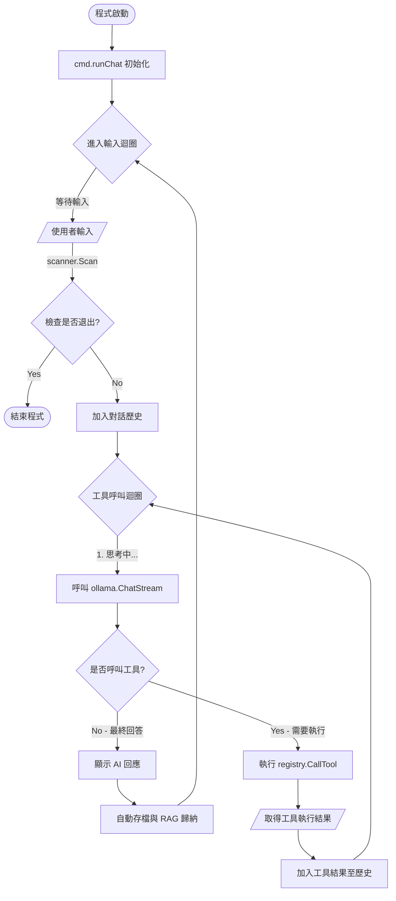

# CLI (Command Line) 訊息處理流程分析

以下是 PCAI 系統處理命令列 (Command Line) 輸入訊息的詳細流程分析。

## 1. 程式啟動與命令解析

使用者在終端機輸入 `go run main.go chat` 啟動程式。

*   **檔案**: `d:\myprograms\pcai\main.go`
    *   **函數**: `main`
    *   **說明**: 呼叫 `cmd.Execute()`。
*   **檔案**: `d:\myprograms\pcai\cmd\root.go`
    *   **函數**: `Execute`
    *   **說明**: Cobra 框架解析指令，識別出 `chat` 子指令。
*   **檔案**: `d:\myprograms\pcai\cmd\chat.go`
    *   **函數**: `init`
    *   **說明**: 註冊 `chatCmd`，設定 Flags (如 Model, System Prompt)。

## 2. 初始化環境 (Initialization)

進入 `chat` 指令的執行邏輯。

*   **檔案**: `d:\myprograms\pcai\cmd\chat.go`
*   **函數**: `runChat` (由 `chatCmd.Run` 觸發)
*   **說明**:
    1.  **UI 初始化**: 設定 `glamour` 渲染器與 `lipgloss` 樣式。
    2.  **工具註冊**:
        *   `bgMgr := tools.NewBackgroundManager()`: 建立背景任務管理器。
        *   `registry := tools.InitRegistry(bgMgr)`: 初始化並註冊所有工具 (如 `ListFiles`, `ShellExec` 等)。
        *   `toolDefs := registry.GetDefinitions()`: 取得給 LLM 看的工具定義 (JSON Schema)。
    3.  **載入記憶**:
        *   `sess := history.LoadLatestSession()`: 讀取對話歷史。
        *   `history.CheckAndSummarize(...)`: 檢查是否需要對舊對話進行歸納 (RAG)。
        *   若為新對話，自動加入 System Prompt。

## 3. 訊息輸入迴圈 (Input Loop)

程式進入無窮迴圈，等待使用者輸入。

*   **檔案**: `d:\myprograms\pcai\cmd\chat.go`
*   **位置**: `for` 迴圈 (行 82)
*   **說明**:
    1.  **顯示提示符**: 印出 `>>> `。
    2.  **讀取輸入**: `scanner.Scan()` 獲取使用者輸入的文字。
    3.  **基本指令檢查**: 檢查是否為 `exit` 或 `quit`。
    4.  **加入歷史**: `sess.Messages = append(..., {Role: "user", Content: input})`。

## 4. LLM 思考與工具執行 (The "Tool-Calling" Loop)

這是一個內層迴圈 (行 109)，負責處理 "思考 -> 執行工具 -> 再思考" 的過城。

### A. 呼叫 LLM (Thinking)
*   **函數**: `ollama.ChatStream`
*   **說明**:
    *   將完整的 `sess.Messages` (包含歷史對話) 與 `toolDefs` (工具定義) 傳送給 Ollama。
    *   串流顯示 AI 的回應文字 (Stream Output)。
    *   **回傳**: `aiMsg` (包含文字內容與可能的 `ToolCalls`)。

### B. 顯示回應
*   使用 `glamour` 渲染器將 Markdown 格式的回應美化並印出。
*   將 `aiMsg` 加入 `sess.Messages`。

### C. 執行工具 (Tool Execution)
*   **判斷**: 檢查 `len(aiMsg.ToolCalls) > 0`。若無工具呼叫，跳出內層迴圈 (等待使用者下次輸入)。
*   **執行**:
    *   遍歷每一個 `ToolCall`。
    *   **執行函數**: `registry.CallTool(tc.Function.Name, argsJSON)` (位於 `tools/registry.go`)。
    *   **顯示狀態**: 印出 `🛠️ Executing...` 提示。
    *   **取得結果**: 獲取工具執行後的純文字結果 (或錯誤訊息)。
*   **反饋**:
    *   將工具執行的結果封裝為 `Tool Message` (`Role: "tool"`).
    *   `sess.Messages = append(...)` 加入歷史紀錄。
*   **遞迴**: 內層迴圈繼續執行，回到 **步驟 A**。
    *   *為什麼？* 因為將工具結果丟回給 LLM 後，LLM 需要根據結果再次生成最終回答 (或決定呼叫下一個工具)。

## 5. 自動存檔 (Auto-Save)

當一輪對話 (使用者輸入 -> AI 回答/工具執行完畢) 結束後。

*   **說明**:
    *   `history.SaveSession(sess)`: 將最新的對話紀錄寫入檔案。
    *   `history.CheckAndSummarize(...)`: 再次檢查是否累積過多對話需要歸納。

---
**總結流程圖**:
`User Input` -> `cmd.runChat` -> `History Append` -> `Loop Start`
   -> `ollama.ChatStream` (Think)
   -> `Check ToolCalls?`
      -> **No**: `Print Response` -> `Save Session` -> `Wait User Input`
      -> **Yes**: `registry.CallTool` (Act) -> `Append Tool Result` -> `Loop Continue` (Re-think)

## Mermaid 流程圖

