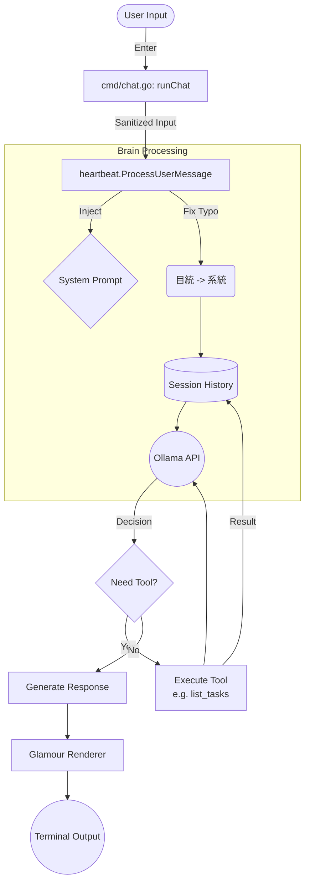

# CLI 訊息處理流程分析

詳細分析使用者從命令列 (CLI) 輸入訊息後，系統如何接收、處理並回覆的完整流程。

## 1. 啟動與輸入 (CLI Entry)

*   **進入點**: `cmd/chat.go` -> `runChat` 函數。
*   **讀取輸入**: 使用 `bufio.Scanner` 監聽 `os.Stdin` (使用者鍵盤輸入)。
*   **觸發條件**: 當使用者輸入文字並按下 Enter 後，程式讀取該行字串 (`input`)。

## 2. 核心調用 (Brain Execution)

*   **調用者**: `cmd/chat.go`
*   **方法**: `brain.ProcessUserMessage(ctx, "cli", input, callbacks)`
*   **參數**:
    *   `sessionID`: 固定為 `"cli"`，代表這是命令列的工作階段。
    *   `callbacks`: 定義了 UI 如何顯示「思考中...」以及工具執行的進度。

## 3. 訊息前處理 (Processor Pre-processing)

*   **檔案**: `internal/heartbeat/processor.go`
*   **步驟**:
    1.  **載入歷史**: `history.LoadSession("cli")` 讀取過去的對話紀錄。
    2.  **系統提示詞注入**: 若為新對話，將 `config.Config` 中的 `SystemPrompt` (包含工具使用說明) 放入對話開頭。
    3.  **錯字自動修正 (Sanitization)**:
        *   系統會檢查特定關鍵字並自動修正。
        *   範例: 將 `目統` 自動替換為 `系統`、`檢察` 替換為 `檢查`。
        *   目的: 確保 LLM 不會因為錯字而無法識別意圖。
    4.  **加入訊息**: 將修正後的使用者訊息存入 `Session.Messages`。

## 4. LLM 思考與生成 (Inference)

*   **檔案**: `llms/ollama/client.go` -> `ChatStream`
*   **動作**: 將完整的對話歷史 (System + User) 發送給 Ollama API。
*   **工具定義**: 同時發送 `b.tools.GetDefinitions()`，讓 LLM 知道有哪些工具可用 (例如 `list_tasks`)。

## 5. 工具調用分支 (Tool Execution)

若 LLM 判斷需要使用工具 (例如使用者輸入「列出工作」)：

1.  **Ollama 回傳**: `ToolCalls` (包含工具名稱 `list_tasks` 與參數)。
2.  **Processor 執行**:
    *   透過 `b.tools.CallTool` 找到對應的 Go 函數 (`tools/list_tasktools.go`)。
    *   執行工具邏輯 (查詢背景任務、磁碟空間等)。
    *   取得工具回傳結果 (Result String)。
3.  **結果回填**: 將工具執行結果以 `role: tool` 的形式加入對話歷史。
4.  **二次推論**: 將包含工具結果的歷史再次發送給 Ollama，讓它生成最終給使用者的友善回應。

## 6. 結果渲染 (Output Rendering)

*   **動作**: `ProcessUserMessage` 回傳最終的 Markdown 字串。
*   **渲染器**: `cmd/chat.go` 使用 `glamour` 套件。
*   **顯示**: 將 Markdown 字串轉換為帶有顏色的終端機格式並印出。
*   **剪貼簿**: 自動將回應內容寫入系統剪貼簿。

---

## Mermaid 流程圖

