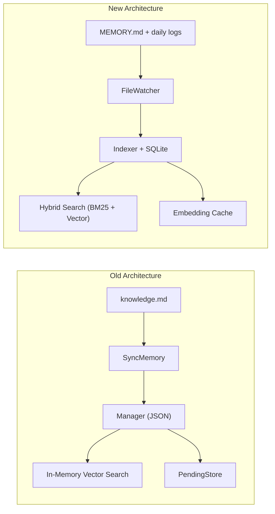

# Memory System Rebuild Documentation

This document consolidates the implementation plan and the execution walkthrough for migrating PCAI's memory system to an OpenClaw-inspired architecture.

---

## Part 1: Implementation Plan

# 記憶系統遷移：OpenClaw Markdown-First Architecture

將 PCAI 現有的 JSON 檔案 + 純記憶體向量搜尋記憶系統，遷移至基於 OpenClaw 設計的 **Markdown-as-Source-of-Truth + SQLite FTS5 混合搜尋**架構。

## 新舊架構對比

| 面向 | 現有架構 | 新架構 |
|-----|---------|-------|
| 資料格式 | JSON (`memory_store.json`) | Markdown (`MEMORY.md` + `memory/YYYY-MM-DD.md`) |
| 索引引擎 | 無（啟動時全載入記憶體） | SQLite + FTS5 (BM25) + Embedding 向量 |
| 搜尋方式 | 向量餘弦 + 簡單關鍵字加成 | **混合搜尋**：BM25 (30%) + 向量 (70%) |
| Embedder | Ollama only | Ollama + OpenAI + Gemini（自動選擇） |
| 快取 | 無 | Embedding Cache（SHA256 Key、SQLite） |
| 記憶沖洗 | 無 | Context Window 到達閾值前自動 Flush |
| 檔案監視 | 無 | 5 秒輪詢 + Debounce |
| 資料庫 | `mattn/go-sqlite3` (CGo) | **`modernc.org/sqlite`** (pure Go，保持與專案一致) |

> [!IMPORTANT]
> - 新的 `memory/` 範例程式碼使用 `github.com/mattn/go-sqlite3`（CGo），但 PCAI 專案已使用 `modernc.org/sqlite`。遷移時將**統一改用**專案已有的 `modernc.org/sqlite`，無需新增依賴。
> - `memory/main.go` 為範例程式，不會移入專案。

---

## Proposed Changes

### 1. internal/memory — 核心套件重寫

完全替換現有 8 個檔案為 5 個新檔案，保持 package 名稱 `memory` 不變。

#### [DELETE] [controller.go](file:///c:/Users/andyl/Myprogram/pcai/internal/memory/controller.go)
#### [DELETE] [executor.go](file:///c:/Users/andyl/Myprogram/pcai/internal/memory/executor.go)
#### [DELETE] [skills.go](file:///c:/Users/andyl/Myprogram/pcai/internal/memory/skills.go)
#### [DELETE] [pending_store.go](file:///c:/Users/andyl/Myprogram/pcai/internal/memory/pending_store.go)
#### [DELETE] [file_job.go](file:///c:/Users/andyl/Myprogram/pcai/internal/memory/file_job.go)
#### [DELETE] [vector.go](file:///c:/Users/andyl/Myprogram/pcai/internal/memory/vector.go)
#### [DELETE] [embedder.go](file:///c:/Users/andyl/Myprogram/pcai/internal/memory/embedder.go)
#### [DELETE] [manager.go](file:///c:/Users/andyl/Myprogram/pcai/internal/memory/manager.go)

#### [NEW] [types.go](file:///c:/Users/andyl/Myprogram/pcai/internal/memory/types.go)
- 所有配置結構 (`MemoryConfig`, `SearchConfig`, `HybridConfig`, etc.)
- 資料結構 (`MemoryChunk`, `SearchResult`, `MemorySearchResponse`)
- `EmbeddingProvider` 介面
- `Manager` 核心管理器 + `NewManager()` + SQLite 初始化
- **關鍵修改**：將 `import _ "github.com/mattn/go-sqlite3"` 改為 `import _ "modernc.org/sqlite"` 並使用 driver name `"sqlite"`
- **關鍵修改**：`WorkspaceDir` 預設改為 PCAI 的 `botmemory/knowledge/`
- 移除未使用的 imports (`regexp`, etc.)

#### [NEW] [indexer.go](file:///c:/Users/andyl/Myprogram/pcai/internal/memory/indexer.go)
- `Chunker` 分塊器（~400 Token/塊, 80 Token 重疊）
- `Indexer` 索引器（SQLite + Embedding 批次寫入）
- `float32SliceToBytes`, `bytesToFloat32Slice` 轉換工具
- `contentHash` 計算函式

#### [NEW] [search.go](file:///c:/Users/andyl/Myprogram/pcai/internal/memory/search.go)
- `SearchEngine` 混合搜尋引擎
- `vectorSearch` 向量餘弦搜尋
- `bm25Search` FTS5 全文搜尋
- `mergeResults` 加權融合
- Embedding Cache 操作
- 數學工具（`cosineSimilarity`, `l2Normalize`, `sanitizeFTS`）

#### [NEW] [flush.go](file:///c:/Users/andyl/Myprogram/pcai/internal/memory/flush.go)
- `Flusher` 記憶沖洗決策器 + `CompactionGuard`
- `MemoryWriter` 今日日誌 + 長期記憶寫入
- `MemoryReader` 記憶讀取 + Session Bootstrap
- `FileWatcher` 檔案監視器
- `IndexMeta` 索引指紋檢查

#### [NEW] [providers.go](file:///c:/Users/andyl/Myprogram/pcai/internal/memory/providers.go)
- `OllamaEmbedder`（**新增**，適配 PCAI 現有 Ollama 環境，實作 `EmbeddingProvider` 介面）
- `OpenAIEmbedder`（來自新程式碼）
- `GeminiEmbedder`（來自新程式碼）
- `AutoSelectProvider` 自動選擇
- `ToolKit` 工具套件 API（`MemorySearch`, `MemoryGet`, `WriteToday`, `WriteLongTerm`, `LoadBootstrap`, `CheckFlush`）
- 新增 `Manager()` 公開方法（`main.go` 範例中有用到）

---

### 2. tools — 工具層更新

#### [MODIFY] [memory_tool.go](file:///c:/Users/andyl/Myprogram/pcai/tools/memory_tool.go)
- `MemoryTool` 改為持有 `*memory.ToolKit` 而非 `*memory.Manager`
- `Run()` 改呼叫 `toolkit.MemorySearch(ctx, query)`
- 結果格式化適配新的 `MemorySearchResponse`

#### [MODIFY] [memory_save.go](file:///c:/Users/andyl/Myprogram/pcai/tools/memory_save.go)
- 改為持有 `*memory.ToolKit`
- 根據 `mode` 參數選擇 `WriteToday()` 或 `WriteLongTerm()`
- 移除 `PendingStore` 依賴（新架構直接寫入 Markdown）

#### [MODIFY] [memory_confirm.go](file:///c:/Users/andyl/Myprogram/pcai/tools/memory_confirm.go)
- **改為 `memory_get` 工具**：讀取特定記憶文件 (`MEMORY.md` 或 `memory/YYYY-MM-DD.md`)
- 使用 `toolkit.MemoryGet(relPath, startLine, numLines)`

#### [MODIFY] [memory_forget.go](file:///c:/Users/andyl/Myprogram/pcai/tools/memory_forget.go)
- 改為簡單的 Markdown 區塊刪除（直接操作 MEMORY.md）
- 移除 `scheduler.Manager` 依賴

#### [MODIFY] [knowledge_search.go](file:///c:/Users/andyl/Myprogram/pcai/tools/knowledge_search.go)
- 改為使用 `toolkit.MemorySearch()` 做混合搜尋，取代文件掃描

#### [MODIFY] [knowledge_append.go](file:///c:/Users/andyl/Myprogram/pcai/tools/knowledge_append.go)
- 改為使用 `toolkit.WriteLongTerm(category, content)` 寫入 MEMORY.md
- 或 `toolkit.WriteToday(content)` 寫入日誌

#### [MODIFY] [backup_manager.go](file:///c:/Users/andyl/Myprogram/pcai/tools/backup_manager.go)
- 備份路徑從 `botmemory/knowledge/knowledge.md` 改為 `botmemory/knowledge/MEMORY.md` 和 `botmemory/knowledge/memory/*.md`

#### [MODIFY] [init.go](file:///c:/Users/andyl/Myprogram/pcai/tools/init.go)
- 移除舊的記憶初始化（`NewOllamaEmbedder`、`NewManager`、`NewPendingStore`、`SyncMemory`、`NewSkillManager`、`NewMemoryExecutor`、`NewController`）
- 新增 `memory.ToolKit` 初始化（使用 `memory.NewToolKit(cfg)`）
- 移除 `SyncMemory` 函式（新架構用 SQLite 索引取代全量同步）
- 更新工具註冊：`NewMemoryTool(toolkit)`, `NewMemorySaveTool(toolkit)` 等
- 移除 `history.GlobalMemoryController` 注入（改為注入 ToolKit）

---

### 3. 上層整合更新

#### [MODIFY] [history.go](file:///c:/Users/andyl/Myprogram/pcai/internal/history/history.go)
- 移除 `GlobalMemoryController`（`memory.Controller` 已不存在）
- 新增 `GlobalMemoryToolKit *memory.ToolKit` 全域變數
- `CheckAndSummarize`：用 `GlobalMemoryToolKit.WriteToday()` 取代 Controller 的 skill 觸發
- `saveToKnowledgeBase`：改用 `GlobalMemoryToolKit.WriteLongTerm()` 寫入

#### [MODIFY] [rag.go](file:///c:/Users/andyl/Myprogram/pcai/internal/history/rag.go)
- `GetRAGEnhancedPrompt`：改讀 `botmemory/knowledge/MEMORY.md` + 使用 `GlobalMemoryToolKit.LoadBootstrap()` 載入 session 記憶

#### [MODIFY] [session.go](file:///c:/Users/andyl/Myprogram/pcai/internal/history/session.go)
- `EnsureHistoryDir` 路徑保持 `botmemory/history`（不動）

#### [MODIFY] [memory_handler.go](file:///c:/Users/andyl/Myprogram/pcai/internal/webapi/memory_handler.go)
- 改為持有 `*memory.ToolKit`
- `handleList` → `ToolKit.MemorySearch(ctx, "*")`（搜尋所有記憶）
- `handleCreate` → `ToolKit.WriteLongTerm(key, value)` 或 `WriteToday(content)`
- `handleDelete` → 直接操作 MEMORY.md 移除區塊

#### [MODIFY] [server.go](file:///c:/Users/andyl/Myprogram/pcai/cmd/server.go)
- 使用 `memory.NewToolKit(cfg)` 取代 `memory.NewManager(jsonPath, embedder)`

#### [MODIFY] [config.go](file:///c:/Users/andyl/Myprogram/pcai/internal/config/config.go)
- 新增 `MemoryWorkspace` 設定欄位（預設 `botmemory/knowledge`）
- 可選：新增 `EmbeddingProvider` 設定（預設 `"ollama"`）

#### [MODIFY] [agent.go](file:///c:/Users/andyl/Myprogram/pcai/internal/agent/agent.go)
- `toolNameToMemorySource` 新增 `"memory_get"` 對應

---

### 4. 資料目錄結構變化

```
botmemory/
├── knowledge/
│   ├── MEMORY.md              # 長期記憶（精選事實）[NEW]
│   ├── memory/
│   │   ├── 2026-02-18.md      # 今日日誌 [NEW]
│   │   ├── 2026-02-17.md      # 昨日日誌 [NEW]
│   │   └── ...
│   ├── knowledge.md           # 舊格式（保留向下相容讀取）
│   ├── memory_store.json      # 舊格式（不再使用，留存備份）
│   └── pcai_memory.sqlite     # SQLite 索引+向量+FTS5 [NEW]
├── history/                   # 保持不變
├── pcai.db                    # 現有資料庫（保持不變）
└── ...
```

---

## Verification Plan

### Automated Tests

1. **編譯驗證**
   ```bash
   cd c:\Users\andyl\Myprogram\pcai
   go build ./...
   ```
   須確保所有套件無編譯錯誤。

2. **現有測試不破壞**
   ```bash
   cd c:\Users\andyl\Myprogram\pcai
   go test ./systemtesting/... -v -count=1
   ```
   現有的 6 個測試檔（tool_hint, registry, skill_loader, dynamic_tool, calendar_postprocess, integration）不應因記憶遷移而失敗。

3. **新增記憶套件單元測試**（寫在 `internal/memory/memory_test.go`）
   - 測試 `Chunker.ChunkFile` 分塊正確性
   - 測試 `SearchEngine` BM25 搜尋
   - 測試 `Flusher.Decide` 沖洗決策邏輯
   - 測試 `MemoryWriter` / `MemoryReader` 讀寫
   - 測試 `contentHash`, `float32SliceToBytes` 等工具函式
   ```bash
   cd c:\Users\andyl\Myprogram\pcai
   go test ./internal/memory/... -v -count=1
   ```

### Manual Verification

> [!NOTE]
> 以下手動驗證需要 Ollama 服務在運行中且 `mxbai-embed-large` 模型已安裝。

1. 啟動 PCAI chat 模式 (`pcai chat`)，確認啟動時不報錯
2. 輸入 `記住我喜歡 Golang`，確認 LLM 觸發 `memory_save` 工具且寫入成功
3. 輸入 `我喜歡什麼程式語言？`，確認 LLM 觸發 `memory_search` 且回傳正確結果
4. 確認 `botmemory/knowledge/MEMORY.md` 或 `botmemory/knowledge/memory/YYYY-MM-DD.md` 有新內容

---

## Part 2: Walkthrough

# Memory System Migration Walkthrough

## Summary
Migrated PCAI's memory system from a JSON-file-based, in-memory vector search architecture to an OpenClaw-inspired Markdown-first system with **SQLite hybrid search** (BM25 + Vector), **embedding cache**, and **file watching**.

## Changes Made

### Core Package: `internal/memory/` (5 new files, 8 old deleted)

| File | Purpose |
|------|---------|
| [types.go](file:///c:/Users/andyl/Myprogram/pcai/internal/memory/types.go) | Config structs, Manager with SQLite init (`modernc.org/sqlite`), FTS5 schema |
| [indexer.go](file:///c:/Users/andyl/Myprogram/pcai/internal/memory/indexer.go) | Markdown chunker + batch indexer with embedding cache |
| [search.go](file:///c:/Users/andyl/Myprogram/pcai/internal/memory/search.go) | Hybrid BM25+Vector search engine with weighted fusion |
| [flush.go](file:///c:/Users/andyl/Myprogram/pcai/internal/memory/flush.go) | Memory writer/reader + compaction guard + polling file watcher |
| [providers.go](file:///c:/Users/andyl/Myprogram/pcai/internal/memory/providers.go) | Ollama/OpenAI/Gemini embedders + ToolKit public API |

### Tools Layer (6 files rewritten)

| File | Old → New |
|------|-----------|
| [memory_tool.go](file:///c:/Users/andyl/Myprogram/pcai/tools/memory_tool.go) | `Manager.Search` → `ToolKit.MemorySearch` (hybrid) |
| [memory_save.go](file:///c:/Users/andyl/Myprogram/pcai/tools/memory_save.go) | PendingStore → `WriteToday`/`WriteLongTerm` (direct write) |
| [memory_confirm.go](file:///c:/Users/andyl/Myprogram/pcai/tools/memory_confirm.go) | MemoryConfirmTool → **MemoryGetTool** (`ToolKit.MemoryGet`) |
| [memory_forget.go](file:///c:/Users/andyl/Myprogram/pcai/tools/memory_forget.go) | Scheduler-based → direct Markdown section removal |
| [knowledge_search.go](file:///c:/Users/andyl/Myprogram/pcai/tools/knowledge_search.go) | File scanning → `ToolKit.MemorySearch` |
| [knowledge_append.go](file:///c:/Users/andyl/Myprogram/pcai/tools/knowledge_append.go) | Direct file append → `ToolKit.WriteLongTerm` |

### Integration Layer

| File | Change |
|------|--------|
| [init.go](file:///c:/Users/andyl/Myprogram/pcai/tools/init.go) | Replaced Manager/PendingStore/Controller init with `NewToolKit()` |
| [history.go](file:///c:/Users/andyl/Myprogram/pcai/internal/history/history.go) | `GlobalMemoryController` → `GlobalMemoryToolKit` |
| [rag.go](file:///c:/Users/andyl/Myprogram/pcai/internal/history/rag.go) | `LoadBootstrap()` with MEMORY.md/knowledge.md fallback |
| [server.go](file:///c:/Users/andyl/Myprogram/pcai/cmd/server.go) | ToolKit init with config |
| [memory_handler.go](file:///c:/Users/andyl/Myprogram/pcai/internal/webapi/memory_handler.go) | ToolKit-based REST API |
| [health.go](file:///c:/Users/andyl/Myprogram/pcai/cmd/health.go) | `ChunkCount()` replaces `GetKnowledgeStats()` |

## Architecture Comparison



## Validation

- ✅ `go build ./...` — compiles with exit code 0
- ✅ `go mod tidy` — dependencies resolved
- ✅ Old `memory/*.go` reference code excluded (renamed to `.go.bak`)
