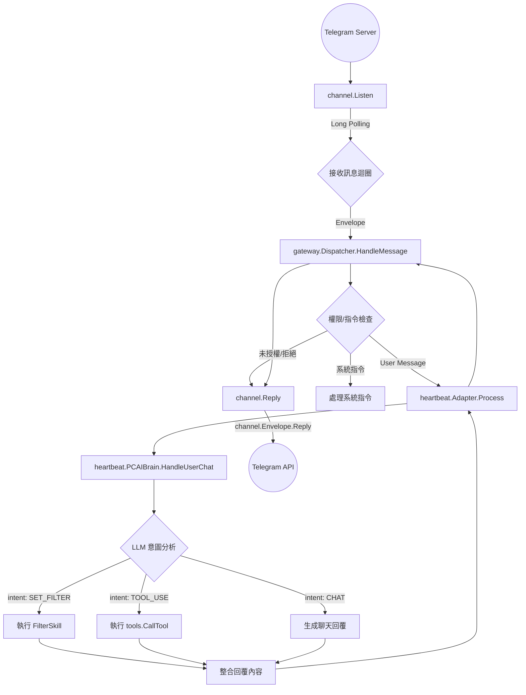

# Telegram 訊息處理流程分析

以下是 PCAI 系統處理 Telegram 訊息的詳細流程分析，從程式啟動到訊息回覆的完整步驟。

## 1. 系統初始化 (Initialization)

在程式啟動時，會初始化 Telegram Channel 並建立連結。

*   **檔案**: `d:\myprograms\pcai\tools\init.go`
*   **函數**: `InitRegistry`
*   **說明**:
    1.  檢查 `cfg.TelegramToken` 是否存在。
    2.  建立 `BrainAdapter` (連結大腦)。
    3.  建立 `Dispatcher` (訊息調度員)。
    4.  建立 `TelegramChannel`。
    5.  啟動 Goroutine 執行 `tgChannel.Listen(dispatcher.HandleMessage)`，開始背景監聽。

## 2. 接收訊息 (Listening)

透過 Long Polling 方式從 Telegram 伺服器接收訊息。

*   **檔案**: `d:\myprograms\pcai\internal\channel\telegram.go`
*   **函數**: `Listen`
*   **說明**:
    1.  呼叫 `t.bot.UpdatesViaLongPolling` 持續接收更新。
    2.  在 `for update := range updates` 迴圈中處理每一則訊息。
    3.  提取訊息內容 (`msg.Text`) 與發送者 ID (`msg.Chat.ID`)。
    4.  將訊息封裝成 `Envelope` 結構 (包含統一的 `Reply` 方法)。
    5.  呼叫 `handler(env)`，此處的 handler 即為 `Dispatcher.HandleMessage`。

## 3. 訊息調度與權限檢查 (Dispatcher)

統一的入口點，負責初步篩選與權限控管。

*   **檔案**: `d:\myprograms\pcai\internal\gateway\dispatcher.go`
*   **函數**: `HandleMessage`
*   **說明**:
    1.  **權限檢查**: 呼叫 `isAuthorized(env.SenderID)` 檢查發送者是否在白名單內。若否，直接回覆拒絕訊息。
    2.  **系統指令**: 檢查是否為 `/` 開頭的指令 (例如 `/auth`)，若是則呼叫 `handleSystemCommand` 處理。
    3.  **轉發處理**: 若通過檢查且非系統指令，啟動 Goroutine 呼叫 `d.processor.Process(env.Content)` (即 `Adapter` 的 `Process` 方法)。

## 4. 介面轉接 (Adapter)

將 Gateway 的呼叫轉換為 Brain 能理解的呼叫。

*   **檔案**: `d:\myprograms\pcai\internal\heartbeat\adapter.go`
*   **函數**: `Process`
*   **說明**:
    1.  建立 `context.Background()`。
    2.  直接呼叫核心邏輯 `a.brain.HandleUserChat(ctx, input)`。

## 5. 大腦意圖分析與執行 (Brain Processing)

核心邏輯層，使用 LLM 分析語意並執行對應動作。

*   **檔案**: `d:\myprograms\pcai\internal\heartbeat\processor.go`
*   **函數**: `HandleUserChat`
*   **說明**:
    1.  **意圖分析**: 呼叫 `analyzeIntentWithOllama` (使用 LLM) 分析用戶輸入，判斷意圖 (`intent`)。
    2.  **執行分支**:
        *   **`SET_FILTER`**: 呼叫 `b.filterSkill.Execute` 更新過濾規則資料庫 (自我學習)。
        *   **`TOOL_USE`**: 透過 `b.tools.CallTool` (位於 `tools/registry.go`) 執行實際工具 (如查詢檔案、搜尋知識庫)。
        *   **`CHAT`**: 單純對話，直接回傳 LLM 生成的回覆 (`intentResp.Reply`)。

## 6. 回覆訊息 (Reply)

將處理結果回傳給使用者。

*   **流程**:
    1.  `HandleUserChat` 回傳結果字串給 `Adapter.Process`。
    2.  `Adapter.Process` 回傳給 `Dispatcher` 的 Goroutine。
    3.  `Dispatcher` 呼叫 `env.Reply(response)`。
*   **底層實作**: `d:\myprograms\pcai\internal\channel\telegram.go`
    *   `Reply` 閉包函數內呼叫 `t.bot.SendMessage`，將文字推送到 Telegram。

---
**總結流程圖**:
`Telegram Server` -> `channel.Listen` -> `gateway.Dispatcher` -> `heartbeat.BrainAdapter` -> `heartbeat.PCAIBrain` -> `LLM/Tools` -> `回傳字串` -> `channel.Reply` -> `Telegram User`

## Mermaid 流程圖

