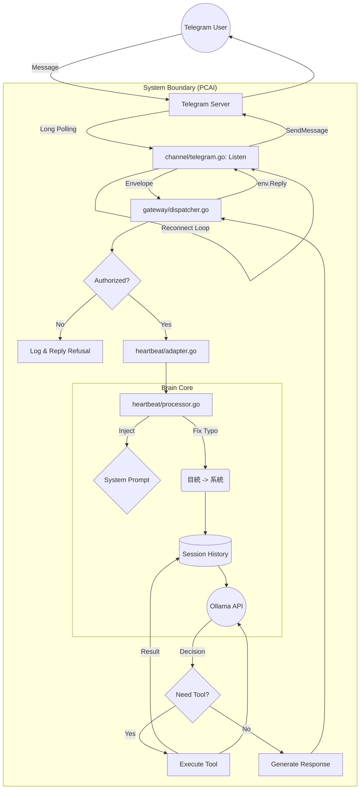

# Telegram 訊息處理流程分析 (Updated)

詳細分析使用者從 Telegram 發送訊息後，系統如何透過 Gateway、Brain 與 LLM 進行處理與回覆的完整流程。

## 1. 訊息監聽與接收 (Channel Listening)

*   **檔案**: `internal/channel/telegram.go`
*   **機制**: Long Polling (長輪詢) + 自動重連機制。
*   **流程**:
    1.  `Listen` 函數啟動無限迴圈。
    2.  呼叫 `bot.UpdatesViaLongPolling` 等待 Telegram 伺服器推播訊息。
    3.  **Robustness (強健性)**: 若連線斷開，系統會記錄錯誤並等待 5 秒後自動重試，確保服務不中斷。
    4.  **篩選**: 只處理文字訊息，過濾掉非文字更新。
    5.  **封裝**: 將訊息封裝為統一的 `Envelope` 結構 (包含 `Reply` callback)，屏蔽底層 API 細節。

## 2. 網關調度與權限 (Gateway Dispatching)

*   **檔案**: `internal/gateway/dispatcher.go`
*   **流程**:
    1.  `HandleMessage` 接收 `Envelope`。
    2.  **Authentication (權限檢查)**:
        *   檢查 `env.SenderID` 是否在白名單 (`authorizedUsers`) 中。
        *   若未授權，記錄詳細日誌 (包含當前白名單內容) 並回覆拒絕訊息。
    3.  **System Commands**: 檢查是否為 `/` 開頭的系統指令 (如 `/auth`)。
    4.  **Forwarding**: 若通過檢查，啟動 Goroutine 將訊息轉發給 Processor。

## 3. 核心處理 (Brain Processing)

*   **檔案**: `internal/heartbeat/processor.go`
*   **流程**:
    1.  `Adapter.Process` 呼叫 `processUserMessage`。
    2.  **Session Loading**: 讀取該使用者的對話歷史 (`sessionID` 為 Telegram Chat ID)。
    3.  **System Prompt Injection**:
        *   若為新對話，從 `config` 注入全域設定的 `System Prompt`。
        *   這確保了 LLM 知道如何使用工具以及遵守行為準則 (包含容錯指示)。
    4.  **Input Sanitization (輸入淨化)**:
        *   **關鍵修正**: 在送給 AI 之前，程式碼會先進行「硬修正」。
        *   例如：將 `目統` 強制替換為 `系統`，`檢察` 替換為 `檢查`。
        *   這解決了語音輸入或錯字導致 LLM 無法觸發工具的問題。

## 4. LLM 推論與工具執行 (Inference & Tooling)

*   **檔案**: `llms/ollama/client.go`
*   **流程**:
    1.  將修正後的訊息與對話歷史發送給 Ollama。
    2.  **Tool Decision**: LLM 判斷是否需要呼叫工具 (例如 `list_tasks`)。
    3.  **Tool Execution**:
        *   Processor 接收 `ToolCalls`。
        *   執行對應的 Go 函數 (如查詢排程、資料庫)。
        *   將結果以 `role: tool` 寫回歷史。
    4.  **Final Response**: LLM 根據工具結果生成最終的自然語言回覆。

## 5. 回覆推送 (Reply Dispatch)

*   **流程**:
    1.  Processor 回傳最終字串。
    2.  Dispatcher 透過 `env.Reply` 回調函數。
    3.  `TelegramChannel` 呼叫 `bot.SendMessage` 將訊息推送到 Telegram App。

---

## Mermaid 流程圖

